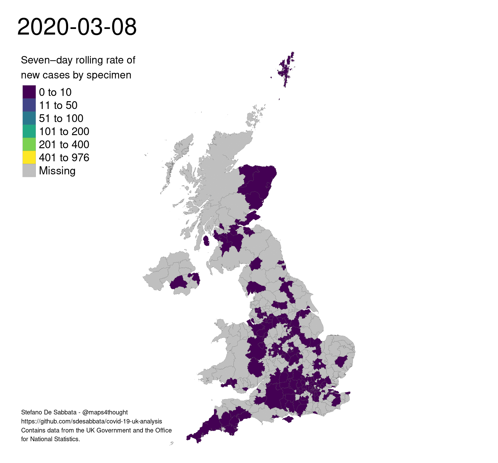

# Mapping Covid-19 cases in UK

by *[Stefano De Sabbata](https://stefanodesabbata.com)*

Covid data available from the [Coronavirus (COVID-19) in the UK governament page](https://coronavirus-staging.data.gov.uk/).

## United Kingdom

### Seven–day rolling rate

Seven–day rolling rate of new cases by specimen (see R script `Covid19_map_uk_new_animated.R`).

### Total cases rate

Total covid-19 cases per 100,000 inhabitants (see R script `Covid19_map_uk_fixed_animated.R`, as well as `Data/Get_UK_Covid19_data.R`).

[This work](https://github.com/sdesabbata/GY7702) is licensed under the [GNU General Public License v3.0](https://www.gnu.org/licenses/gpl-3.0.html) except where specified.